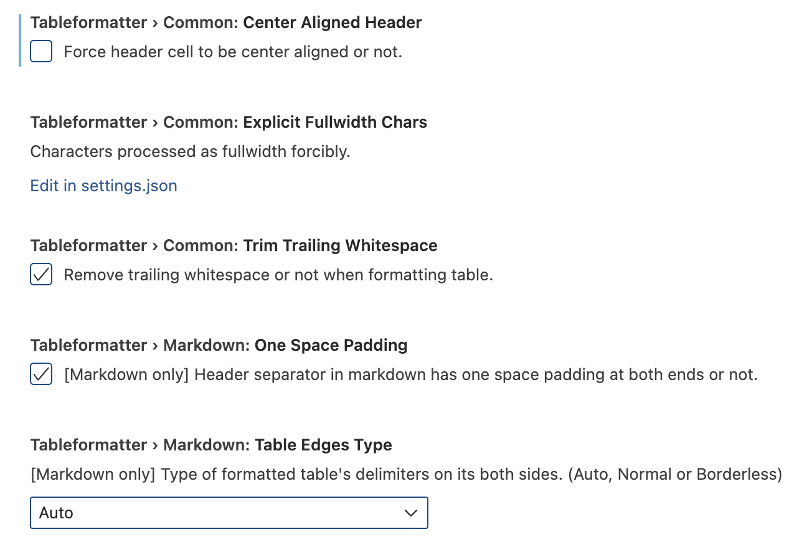

# OCP Specification Tools

This repo contains tooling for rendering OCP specifications from Markdown.

## TCG Pandoc

The scripts in this repository rely on TCG's [Pandoc](https://github.com/TrustedComputingGroup/pandoc) tooling. See the [Guide](https://github.com/TrustedComputingGroup/pandoc/blob/main/guide.tcg) (in PDF form on the TCG Pandoc [Releases](https://github.com/TrustedComputingGroup/pandoc/releases) page).

## How to Run Locally

Due to the complexity of the various Pandoc and LaTeX dependencies at work,
it's easiest to use TCG's published [Docker containers](https://github.com/trustedcomputinggroup/pandoc/pkgs/container/pandoc).

```sh
./docker-pull.sh

# Must run from the directory containing the input file
(cd sample-spec && ../docker-run.sh --pdf sample-spec.pdf sample-spec.ocp)
```

HTML is also supported:

```sh
(cd sample-spec && ../docker-run.sh --html sample-spec.html sample-spec.ocp)
```

## How to integrate with Github Pages

This repo provides a [reusable Github workflow](.github/workflows/render.yml) for rendering specifications to PDF or HTML and publishing them to Github Pages. See [render-sample-spec.yml](.github/workflows/render-sample-spec.yml) for an example usage.

## How to Build Locally

See the TCG Pandoc [README](https://github.com/TrustedComputingGroup/pandoc/blob/main/README.md#how-to-build-locally) for how to build locally.

## Tips and tricks

### Diagrams

Specification diagrams may be generated using draw.io. These can be edited with the [Draw.io Integration](https://marketplace.visualstudio.com/items?itemName=hediet.vscode-drawio) Visual Studio Code extension.

When creating new diagrams, be sure to enable a white background. Otherwise, the diagram will not be legible to viewers with dark mode enabled.

<p align="center">
  
</p>

### Tables

This tooling supports multiple table syntaxes. See [here](https://pandoc.org/demo/example33/8.9-tables.html) for more details on each supported syntax.

Text may overflow table cells when rendered to PDF. There are several techniques for addressing this:

- Shrink the page margin
- Reduce the table font size
- Manually adjust column widths

The page margin can be adjusted by adding `geometry: "left=0.5in,right=0.5in"` to the YAML front-matter.

Table font size can be adjusted like so:

```
Table: some table {#tbl:some-table .small}  <-- or `.tiny` for even smaller font size

+-------+-------+
| Col 1 | Col 2 |
+=======+=======+
| Some  | text  |
+-------+-------+
```

Table column widths can be adjusted like so:

```
The column widths are based on the relative widths of the separator row after the column headers.

| Col 1 | Col 2 | Col 3 | Col 4 |
|----|---|-------|----|                     <-- The widths of the separators on this line determine column widths.
| Some | text | of | varying length |
| 123 | 123 | 123 | 123 |


| Col 1 | Col 2 | Col 3 | Col 4          |
| ----- | ----- | ----- | -------------- |  <-- Auto-formatting a table will make these lengths match the column text.
| Some  | text  | of    | varying length |
| 123   | 123   | 123   | 123            |


+-------+-------+-------+---------+
| Col 1 | Col 2 | Col 3 | Col 4   |
+=======+=======+=======+=========+         <-- Grid tables let you wrap text within the cell to control the column width.
| Some  | text  | of    | varying |
|       |       |       | length  |
+-------+-------+-------+---------+
| 123   | 123   | 123   | 123     |
+-------+-------+-------+---------+
```

It is recommended to use a plugin to aid in formatting grid tables. This [Table Formatter](https://marketplace.visualstudio.com/items?itemName=shuworks.vscode-table-formatter) extension is suitable. When using this extension, ensure that its settings match what appear here:

<p align="center">
  
</p>

Note: do not use the extension's "Table: Format All" command, as the extension misinterprets the YAML frontmatter as a table, and attempts to format it.

Note: while grid tables support rowspan or colspan cells, this extension cannot format them. One workaround is to format the table with all edges present, and then as a last step, remove the edges needed to produce the desired rowspan or colspan cells.
